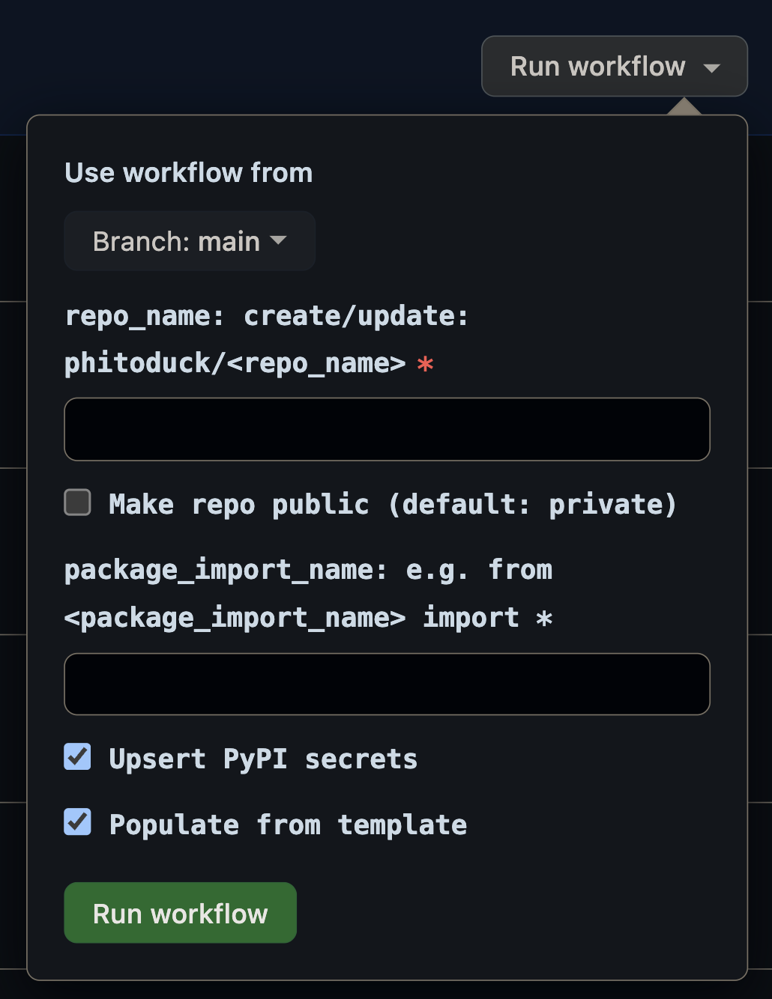
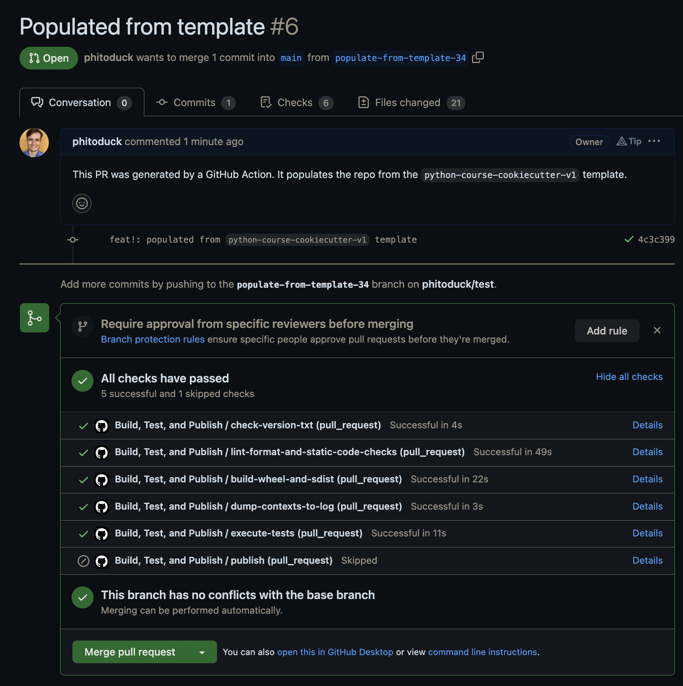
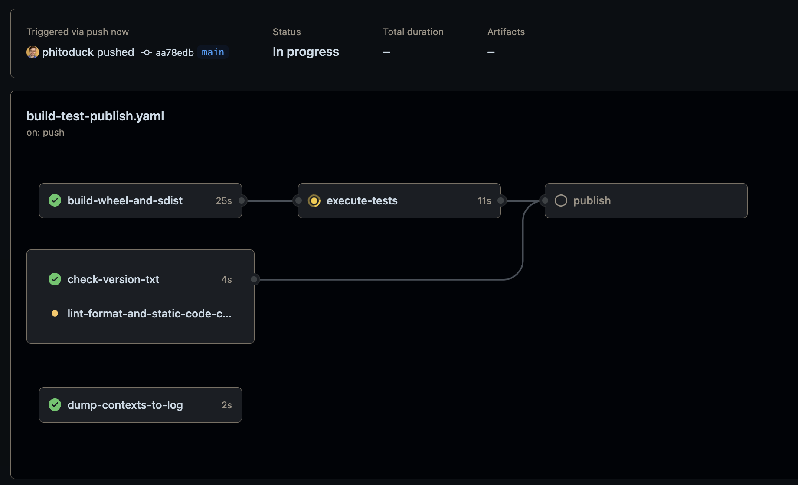
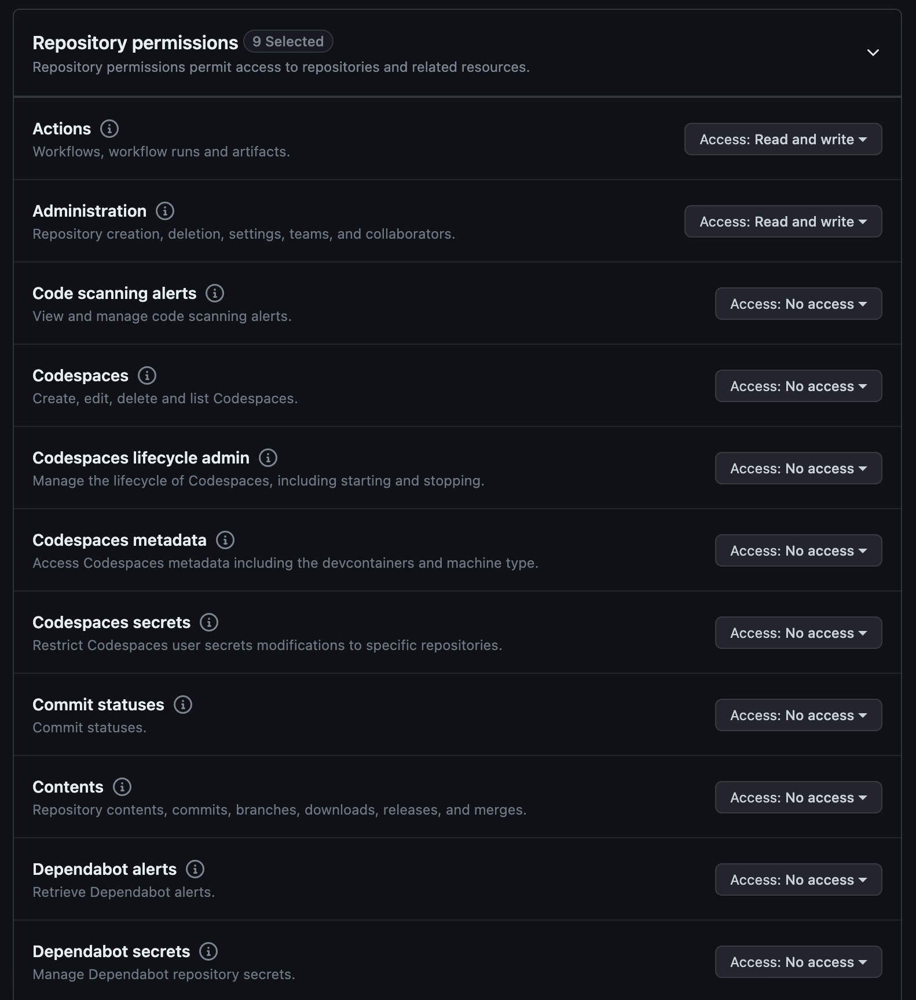
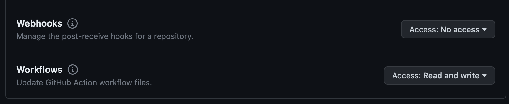
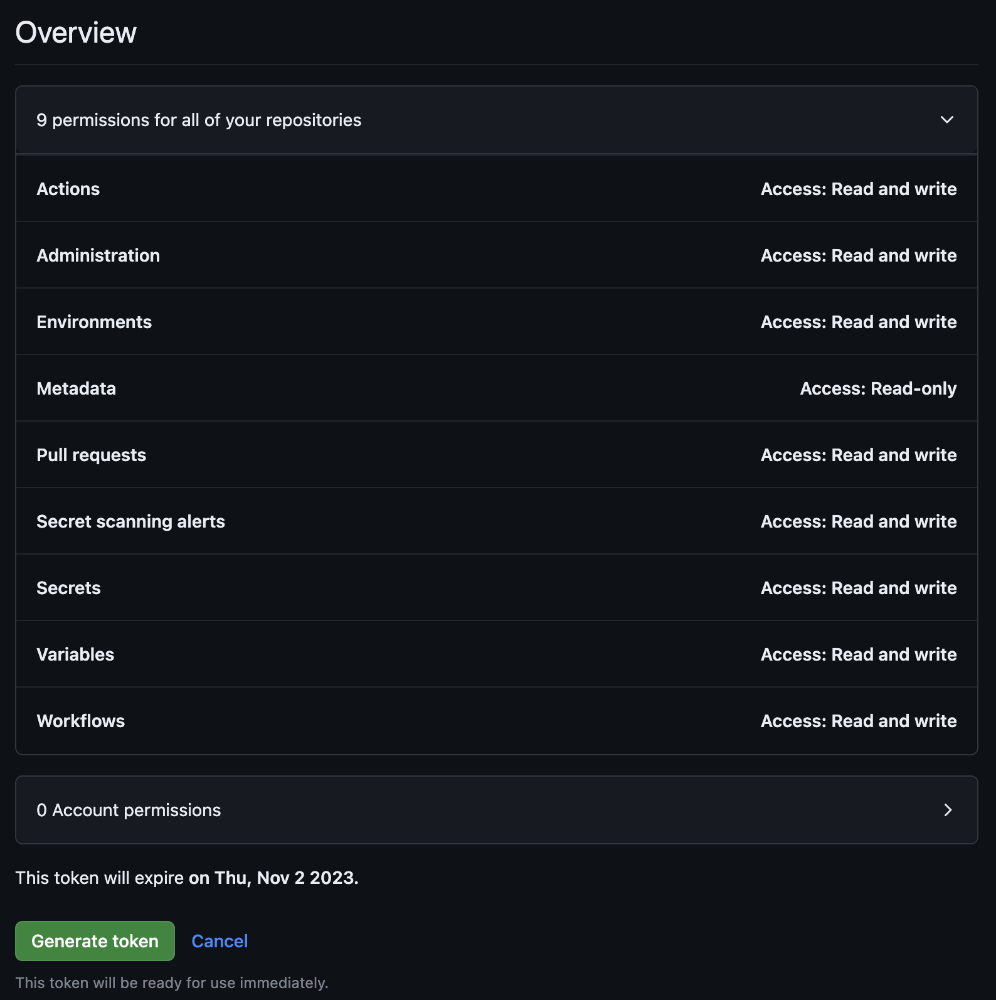

# Taking Python to Production - Python Package Template

1. Fill out the form
   
2. Creates a repo and/or opens a PR with a template, already passing the build
   
   

3. created folder
4. `git init; git branch -M main`
5. `mkdir '{{cookiecutter.repo_name}}'`
6. `cp -R ../packaging/* ../packaging/.* '{{cookiecutter.repo_name}}'`
7. deleted the venvs since they're bad when moved
8. remove the .git folder inside of cookiecutter.repo_name
9.  `cd '{{cookiecutter.repo_name}}'; ./run.sh clean`
10. got this error `A valid repository for "/home/eric/repos/python-course-cookiecutter-v1" could not be found in the following locations:`. The reason is a `cookiecutter.json` file must exist at the repo root.
11. made the decision to create a `src/` folder
12. the `.github/workflows.publish.yml` has issues with jinja because of the `${{ secrets... }}` syntax. It needs to be escaped with `` and ``.
  - adding the `--verbose` flag to `cookiecutter` prints out each file so you can tell exactly the file it fails on
13. `.vscode/settings.json` seems to not be very filled out, we should find that from previous videos

Had to add this in order to pass the build for this repo
```yaml
- name: Configure git user
  run: |
    git config --global user.email "test@test.com"
    git config --global user.name "Eric Riddoch"
```

- GitHub Token
  
  
  
  

