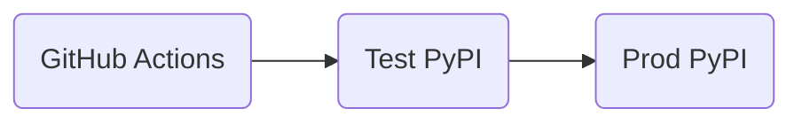
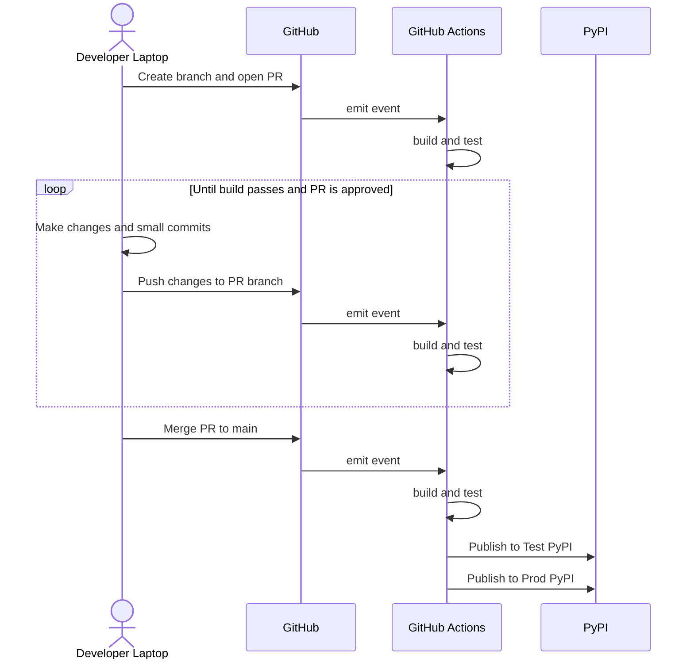
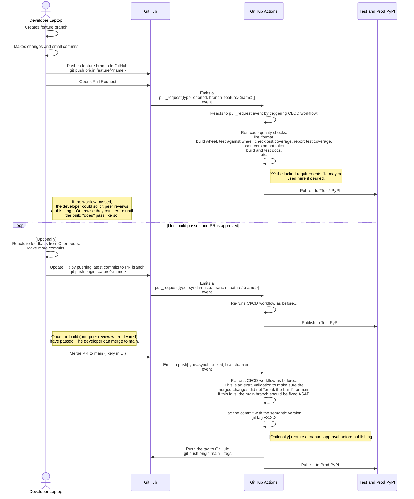
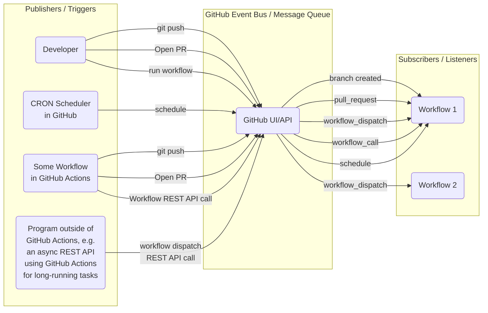
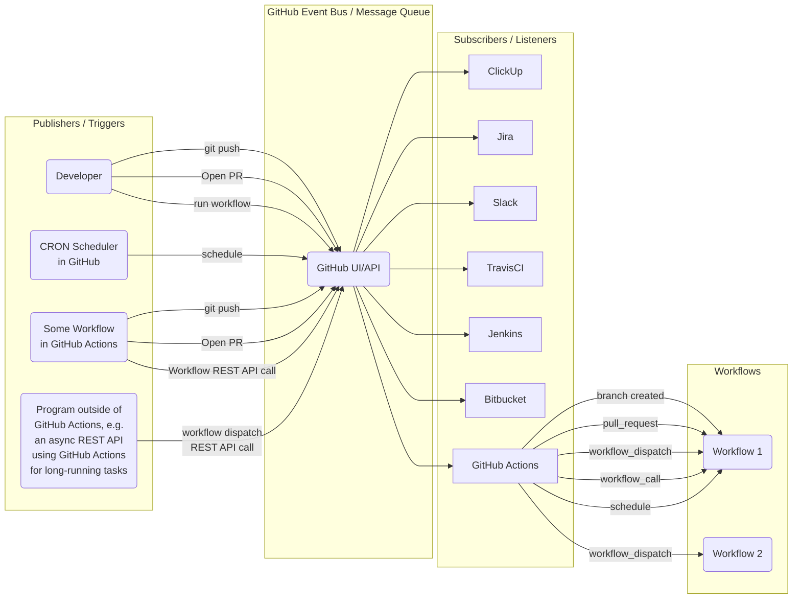

# Continuous Delivery using GitHub Actions

## Goals

1. Understand Continuous Delivery
2. Know the parts of a CI/CD pipeline for Python packages
3. Have an advanced understanding of GitHub Actions

           

## Delivery "Environments"

Dev -> QA/Staging -> Prod

- 0.0.0rc0
- 0.0.0rc1
- 0.0.0a0
- 0.0.0b0

           
## High-level CI/CD Workflow for Python packages

           

## Detailed CI/CD Workflow for Python Packages

           

## GitHub Actions as a Pub-Sub System

Notes:
- Workflows may be in different repositories. A single event might trigger multiple workflows in different repos.

### GitHub Actions with 3rd-Party Subscribers

           

## Version bumping

### Manual

Locally

1. manually edit `version.txt` (and optionally CHANGELOG)
2. ci for PR: fail if version is taken
3. append `rc-<short commit hash>` to `version.txt`

CI

4. `python -m build` picks up `project.version` as N + 1 by reading version.txt because it is marked
   as a dynamic field under `tools.setuptools.dynamic`

Write the Changelog manually.

### With commitizen

Locally

1. cz reads version N from version.txt
2. cz reads commit messages since version N was last written
3. cz computes what sort of version bump it was and computes version N + 1
4. cz writes version N + 1 to version.txt

[Optional] After all this, commitizen can also generate the changelog.

CI

1. git: tags commit with version N + 1 to make sure the version isn't taken; may require new commit message
2. script: appends `rc-<short commit hash>` to version.txt if not run on the main branch
3. `python -m build` picks up `project.version` as N + 1 by reading version.txt because it is marked
   as a dynamic field under `tools.setuptools.dynamic`

Goals for tonight

- [x] publish a package to PyPI locally
- [ ] publish the package from CI
- [ ] find a way to push tags *not* during PR, but yes after merge

Bonus: tests

- [ ] compute test coverage with coverage
- [ ] show coverage in different formats
- [ ] fail if coverage is below a certain threshold
- [ ] compute test coverage even if not all tests pass, or argue why this isn't valuable

Bonus GA

- [x] find a way to print the variables, event, etc. for easy debugging

Publishing to PyPI

Try locally

- sign up for PyPI and Test PyPI
- create a .env file
- create a .gitignore file for .env
- add PYPI_USERNAME and PYPI_PASSWORD to .env
- add TEST_PYPI_USERNAME and TEST_PYPI_PASSWORD to .env
- add twine and build to the dev extra in pyproject.toml
